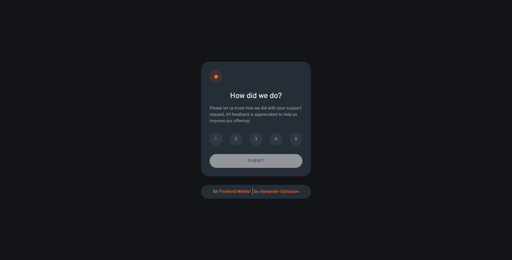
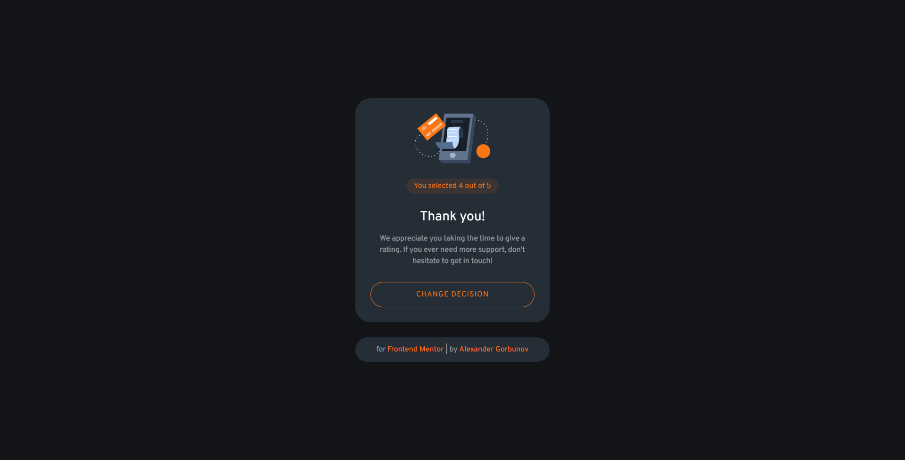
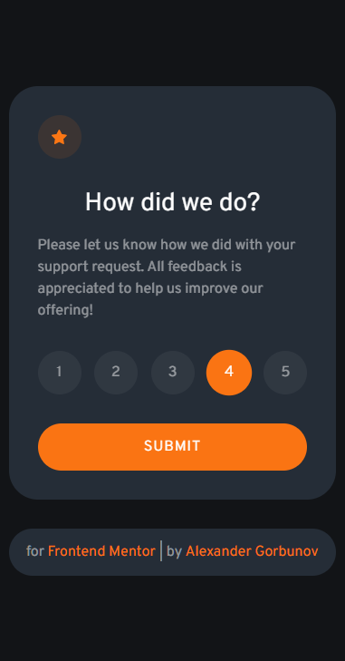
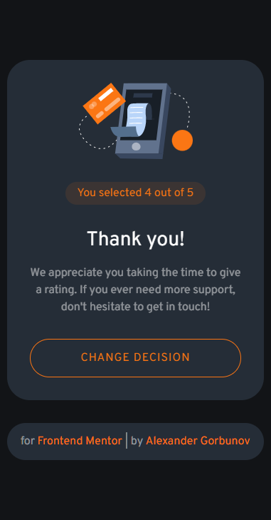

# Advice Generator App

<p align="center">
  
</p>

<p align="center">
  
</p>

<p align="center">
  
  
</p>

## ℹ️ About


This is a solution to the [Interactive rating component challenge on Frontend Mentor](https://www.frontendmentor.io/challenges/interactive-rating-component-koxpeBUmI).

The challenge is to build out this interactive rating component and get it looking as close to the design as possible.

See [task.md](./docs/task.md) for more details about the task.

Your users should be able to:

- View the optimal layout for the app depending on their device's screen size
- See hover states for all interactive elements on the page
- Select and submit a number rating
- See the "Thank you" card state after submitting a rating

## ⚙️ Tools

- **HTML5**
  - Semantic HTML
- **SASS**
  - Flexbox
  - BEM methodology
  - Responsive design
  - Desktop first
- **TypeScript**
- **NPM**
  - Install TypeScript
- **Github Pages** - for hosting
- **VS Code**
  - _Live Server_ - VS Code extension that launches local servers
  - _Live Sass Complier_ - VS Code extension that transpiles SCSS/SASS files in CSS

## 📁 File Structure

<table>
  <tr>
    <th>Path</th>
    <th>Description</th>
  </tr>
  <tr>
    <td>index.html</td>
    <td>Main HTML file</td>
  </tr>
  <tr>
    <td colspan="2"></td>
  </tr>
  <tr>
    <td>build</td>
    <td>Folder with genereated files</td>
  </tr>
  <tr>
    <td>build / index.css</td>
    <td>CSS, generated with SCSS transpiler</td>
  </tr>
  <tr>
    <td>build / index.js</td>
    <td>JavaScript, generated with TypeScript</td>
  </tr>
  <tr>
    <td colspan="2"></td>
  </tr>
  <tr>
    <td>src</td>
    <td>Source files needed for application development</td>
  </tr>
  <tr>
    <td>src / assets</td>
    <td>Images and other media used on the webpage</td>
  </tr>
  <tr>
    <td>src / index.scss</td>
    <td>Main SCSS file, used to later generate CSS</td>
  </tr>
  <tr>
    <td>src / index.ts</td>
    <td>Main file with TS</td>
  </tr>
  <tr>
    <td colspan="2"></td>
  </tr>
  <tr>
    <td>__tests__</td>
    <td>Folder with tests</td>
  </tr>
  <tr>
    <td>__tests__ / sumbit-feedback.feature</td>
    <td>Business logic tests written with Gherkin syntax</td>
  </tr>
  <tr>
    <td colspan="2"></td>
  </tr>
  <tr>
    <td>docs</td>
    <td>Folder with additional information, documentation</td>
  </tr>
  <tr>
    <td>docs / design</td>
    <td>Folder with images of how the interface must look like</td>
  </tr>
  <tr>
    <td>docs / results</td>
    <td>Folder with screenshots of how the application works after being fully developed</td>
  </tr>
  <tr>
    <td>docs / README-template.md</td>
    <td>Template for README.md, don't use it (from FrontendMentor)</td>
  </tr>
  <tr>
    <td>docs / style-guide.md</td>
    <td>Style information: color palette, fonts, etc. (from FrontendMentor)</td>
  </tr>
  <tr>
    <td>docs / task.md</td>
    <td>Detailed task description (from FrontendMentor)</td>
  </tr>
  <tr>
    <td>docs / interactive-rating-component-main.zip</td>
    <td>Initial archive provided by Frontend Mentor</td>
  </tr>
  <tr>
    <td colspan="2"></td>
  </tr>
  <tr>
    <td>LICENSE</td>
    <td>MIT License</td>
  </tr>
  <tr>
    <td>package-lock.json</td>
    <td>JSON file that keeps track of the exact version of every package that is installed so that a product is 100% reproducible in the same way even if packages are updated by their maintainers</td>
  </tr>
  <tr>
    <td>package.json</td>
    <td>JSON file that holds various metadata relevant to the project. This file is used to give information to npm that allows it to identify the project as well as handle the project's dependencies</td>
  </tr>
  <tr>
    <td>tsconfig.json</td>
    <td>JSON file that holds different compiler options for TypeScript</td>
  </tr>
  
</table>

## 🔨 How to build project

run `npm install`

## 💡 Details

### Working with TypeScript

It didn't help much. Rather it just showed a pile of little errors with types. Hopefully it will appear to be more useful in the future.

For now I don't see any difference with JS, but you have to just add some type description here and there.

<hr>

### Transition between screens

Intially there is a visible screen and an invisible screen hidden with a class containing `display: none`. When you need to switch screens, add a class with animation to the screen you want to hide and by the end of animation add a class with `display: none`. Then add a class with animation to the screen you need to show and remove the class with `display: none`.

```ts
// Hides the rating card, shows the result card
submitButton!.addEventListener("click", () => {
  conclusionText!.innerHTML = `You selected ${feedbackScore} out of 5`;

  (ratingCard as HTMLElement).style.animation = "move-center-to-left .5s forwards";
  (resultCard as HTMLElement).style.animation = "move-right-to-center .5s forwards";

  ratingCard!.addEventListener(
    "animationend",
    () => {
      ratingCard!.classList.add("page--no-display");
      resultCard!.classList.remove("page--no-display");
    },
    { once: true } // The absense of this little boy caused me so much trouble!
  );
});
```

```scss
@keyframes move-center-to-left {
  100% {
    translate: -500px 0px;
    opacity: 0;
  }
}

@keyframes move-left-to-center {
  0% {
    translate: -500px 0px;
    opacity: 0;
  }
}
```

And don't you forget to make the animation work only once `{ once: true }`! I spent about an hour trying to figure out why the animation kept going and going in an endless loop.

Also I discovered that there is a great event called `onanimationend`! I accidentally stumbled upon it, and it helped me to avoid working with `setTimeout` like I did in previous project with generating advices. Also overall it helped to tidy my code and make it work without visual glitches that might happen in certain scenarios.

<hr>

### Activate the button with `Enter` depending on the screen being showed

I rely on absense or presense of `display: none` class in order to bind the `Enter` to a specific button. I assume that only one of them is visible at any given point of time.

And it made the code a little bit superfluous because of TypeScript not willing to work with my initial code. Look at that `as HTMLElement`, `Array.from()`

```ts
// Allows to submit the feedback on "Enter"
document.addEventListener("keydown", (e: KeyboardEvent) => {
  switch (e.key) {
    case "Enter":
      if (!Array.from(ratingCard!.classList).includes("page--no-display")) {
        (submitButton as HTMLElement).focus();
        submitButton!.dispatchEvent(new Event("click"));
      }
      if (!Array.from(resultCard!.classList).includes("page--no-display")) {
        (changeDecisionButton as HTMLElement).focus();
        changeDecisionButton!.dispatchEvent(new Event("click"));
      }
  }
});
```

<hr>

### Disabling a submit button and allowing to choose between options

Initially disable the submit button. Enable the button when there is at least one active element. Disable an active option when you activate another option. Disable the submit button when there are no active elements. Double activation of the same option deactivates the option. As simple as that.

```ts
let feedbackScore: number = 1;
let activeFeedbackOption: Element | undefined;

// ...

// Choose between options and enable/disable the submit button
for (let element of Array.from(scores!.children)) {
  element.addEventListener("click", (e: Event) => {
    feedbackScore = +(e.target as Element).innerHTML;

    // If there is an active option, make it inactive
    if (activeFeedbackOption !== undefined) {
      activeFeedbackOption.classList.remove("score--active");
    }

    // If we choose another option, make the button active
    if (activeFeedbackOption !== e.target) {
      (e.target as Element).classList.add("score--active");
      submitButton!.removeAttribute("disabled");
      activeFeedbackOption = e.target as Element;
    }

    // If we choose the same option, disable the button
    else {
      activeFeedbackOption = undefined;
      submitButton!.setAttribute("disabled", "");
    }
  });
}
```

<hr>

### Figma prototype

I use a free version of FrontendMentor. Thus I don't have access to Figma prototypes. But that's not a problem - I made my own one

Here it is: https://www.figma.com/file/8VPjsKdjo7LMSUJrjLEi6J/Interactive-Rating-Component.-Frontend-Mentor?node-id=0%3A1

That helped me to make the application as close to the photos as possible

<hr>

### Gherkin syntax

I thought about including Jest to add unit test my scripts, but in this case it seems redundant. All functions are tightly related to the DOM elements and depend on their state. Thus it's extremely difficult to test this functions in isolations.

So instead I decided to add Gherkin "Given When Then" scenarios to describe the business logic. I wrote them prior to coding the implemenation. They describe how the interface must work with as few as possible interface details like "press button" and so on.

```gherkin
Feature: Submit feedback

In order to share my attitude towards the support request
As a User
I want to be able to submit my feedback

Scenario: Default
Given User opened the page
Then User is unable to submit the feedback

Scenario: Select only 1 option
Given User opened the page
Then User can select only 1 feedback option
```

<hr>

### Other notes

- Added an option to change the feedback, even though it's not included into the task. Some users might surely want that. Examined solutions of other people and it came to me that my solution might only win from this
- Added a possibility to disable a button when there are no chosen options. That protects the users from accidentally submitting invalid feedback
- Added a nice little animation when pressin on a star on the initial screen with options. Stole that idea from one of the solutions. I spent quite much time to disable the interaction with the element till the end of the animation.
- Changed hover and active states. They look differently in designs
- Added an underline hover effect to links

## 🔗 Useful resources

- [Live server : VS Code extension](https://marketplace.visualstudio.com/items?itemName=ritwickdey.LiveServer)
- [Live SASS Complier : VS Code extension](https://marketplace.visualstudio.com/items?itemName=ritwickdey.live-sass)

## 👤 Author

- Frontend Mentor - [@GrbnvAlex](https://www.frontendmentor.io/profile/GrbnvAlex)
- Telegram - [@Arlagonix](https://t.me/Arlagonix)
- Github - [@arlagonix](https://github.com/arlagonix)
